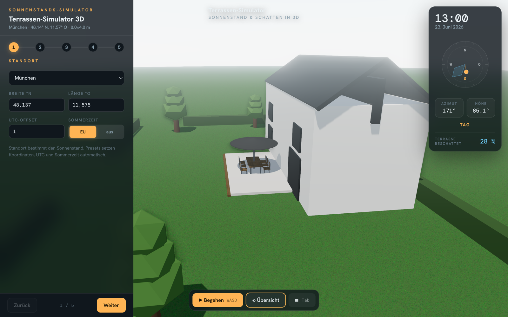

# Terrassen-Simulator 3D

An interactive, physically-accurate sun-and-shade simulator for a terrace, built with Three.js. Set a location, size the terrace, configure walls and furniture, place sun protection (parasol, sail, cantilever umbrella, awning), then scrub through the day to see exactly where the shadow falls and what fraction of the terrace is shaded.

**[▶ Live demo](https://terrace-simulator.bitvaria.com/)** · Open source under the MIT License.



## Run

It must be **served over HTTP** (the local textures are blocked by the browser on `file://` via CORS):

```bash
cd terrace-sun-pro
python3 -m http.server 8000
# open http://localhost:8000/index.html
```

Any static file server works. There is no build step and **no external network requests** — Three.js, the fonts, and all textures are vendored locally.

## Features

- **Solar model** (NOAA) with settable location (presets + lat/lon/UTC/EU-DST), time and date scrubbers.
- **5-step wizard**: Standort → Terrasse → Wände → Ausstattung → Sonne & Schutz.
- **Configurable scene**: terrace size + surface, house wall material, per-side privacy walls (each individually placeable), repositionable table group, furniture and extras.
- **Sun protection**: parasol, shade sail, cantilever umbrella (round/rectangular, swing/tilt), cassette awning — with an all-day shadow trail and a live "% terrace shaded" readout.
- **Two views**: orbit overview and a first-person walk mode (desktop only; pointer-lock).
- **Save/share**: config autosaves to `localStorage`; "Link kopieren" encodes the full scene into a shareable URL.
- Quality toggle (post-processing pipeline scales down for weaker GPUs); graceful fallback when WebGL2 is unavailable.

## Architecture

Single self-contained `index.html`. The solar math and shade geometry are isolated as engine-agnostic pure functions (`Solar`, `sombranoGeom`, `wareamaPlane`, `canopyOutline`, `clipPolyToRect`) so the core could be ported to another engine (e.g. Unreal) without the Three.js layer.

```
index.html              the app
assets/textures/        CC0 PBR material sets (diffuse/normal/roughness)
assets/fonts/           self-hosted webfonts + fonts.css
assets/vendor/three/    vendored Three.js r160 (core + the addons used)
ROADMAP.md              feature history / future ideas
```

## License

This project's own source is licensed under the **MIT License** — see [`LICENSE`](LICENSE).

Bundled third-party components are licensed separately — see
[`THIRD-PARTY-LICENSES.md`](THIRD-PARTY-LICENSES.md):

- **three.js** r160 — MIT (© 2010-2023 three.js authors), vendored under `assets/vendor/three/`.
- **Hanken Grotesk** and **DM Mono** — SIL Open Font License 1.1, vendored under `assets/fonts/`.
- **PBR textures** — CC0 (public domain) from [Poly Haven](https://polyhaven.com).
- The lawn texture is generated procedurally at runtime (no bundled asset).
